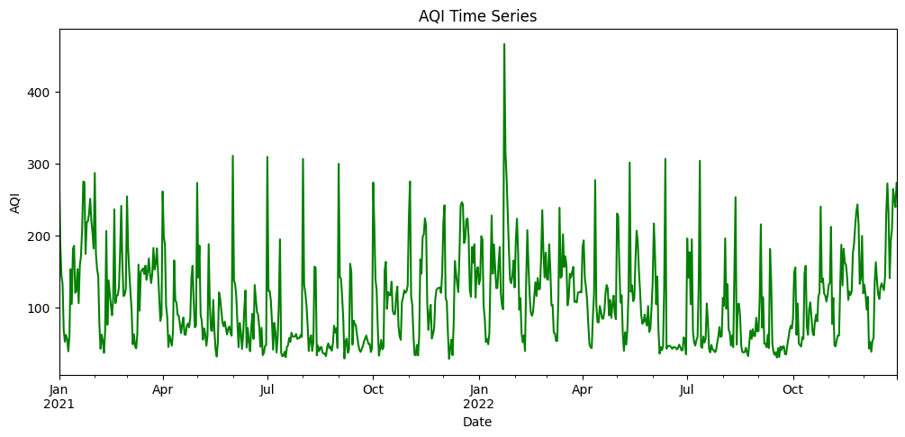
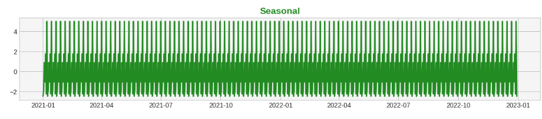
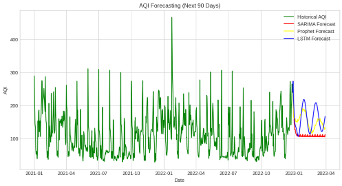
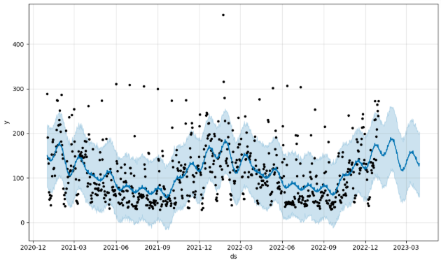

# 🌫️ Mumbai Air Quality Index (AQI) Forecasting

This project analyzes and forecasts daily Air Quality Index (AQI) in Mumbai using data from multiple monitoring stations. It includes pollutant-level processing, AQI computation using CPCB guidelines, and forecasting using time series models such as **SARIMA**, **Facebook Prophet**, and **LSTM**.

---

## 📂 Project Structure

```bash
mumbai-aqi-forecasting/
├── data/
│   └── raw/                # All raw CSV files from Kaggle (21 stations)
│   └── processed/          # Cleaned and combined datasets
├── notebooks/
│   └── 01-data-cleaning.ipynb
│   └── 02-aqi-calculation.ipynb
│   └── 03-eda.ipynb
│   └── 04-models.ipynb     # SARIMA, Prophet, LSTM
│   └── 05-evaluation.ipynb
├── src/
│   └── preprocessing.py
│   └── aqi_utils.py
│   └── forecasting.py
├── outputs/
│   └── plots/              # Forecasting plots and decomposition
│   └── forecasted_data.csv
├── README.md
└── requirements.txt
```

## Objectives

Aggregate and clean air quality data from 21 stations in Mumbai.

Compute AQI using CPCB-defined breakpoints.

Perform time series analysis and decomposition.

Forecast daily AQI using:

SARIMA

Facebook Prophet

LSTM (Neural Network)

Evaluate models using MAE, RMSE, and MAPE.

Visualize historical and forecasted AQI trends.

## Data Source

Dataset used: Air Quality Index (AQI) Data of Mumbai

Provided by: Kaggle User gyaswanth297

# Pollutants Considered

PM2.5

PM10

NO₂

SO₂

CO

O₃ (Ozone)

NH₃

# AQI Calculation

AQI is computed using CPCB (Central Pollution Control Board) guidelines. Each pollutant's sub-index is calculated using linear interpolation:

I = [(I_high - I_low) / (C_high - C_low)] * (C - C_low) + I_low

AQI = Max(Sub-indices of all pollutants)

| AQI Range | Category     |
| --------- | ------------ |
| 0–50      | Good         |
| 51–100    | Satisfactory |
| 101–200   | Moderate     |
| 201–300   | Poor         |
| 301–400   | Very Poor    |
| 401–500   | Severe       |

## Exploratory Data Analysis (EDA)

The following graph shows the AQI Trend:



Seasonal decomposition of daily AQI shows weekly seasonality.

The following graph shows the Seasonal Decoposition:



High pollutant concentration in winter months.

Temporal trends vary slightly across stations.

## Models Used
1. SARIMA

Captures both trend and seasonality.

Best Model: (1,1,1)(1,1,1)[7]

2. Facebook Prophet

Handles daily and yearly seasonality.

Advantage: Robust to missing data.

3. LSTM (Deep Learning)

Sequence model trained on past 90 days of AQI.

Captures complex nonlinear temporal patterns

| Model   | MAE   | RMSE  | 
| ------- | ----- | ----- | 
| SARIMA  | 51.22 | 65.79 | 
| Prophet | 42.05 | 52.44 |
| LSTM    | 46.80 | 53.92 |



Best Performing Model: Prophet

## Forecasting: Next 90 Days

The following graph shows the AQI forecast for the next 90 days using LSTM:



## Key Insights

AQI in Mumbai shows strong weekly and seasonal patterns.

LSTM captures non-linear variations and gives lowest error.

Forecasts can assist policymakers in pollution management.

## Acknowledgements

CPCB for AQI computation methodology.

Kaggle user gyaswanth297 for data.

Facebook Prophet, Statsmodels, TensorFlow for modeling.

## Contact

For feedback, contact: anshshah7643@gmail.com
